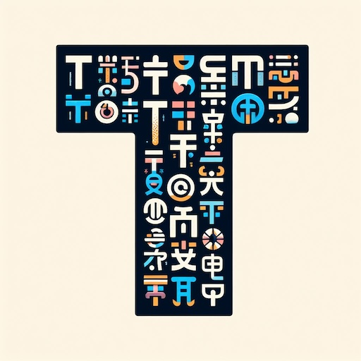
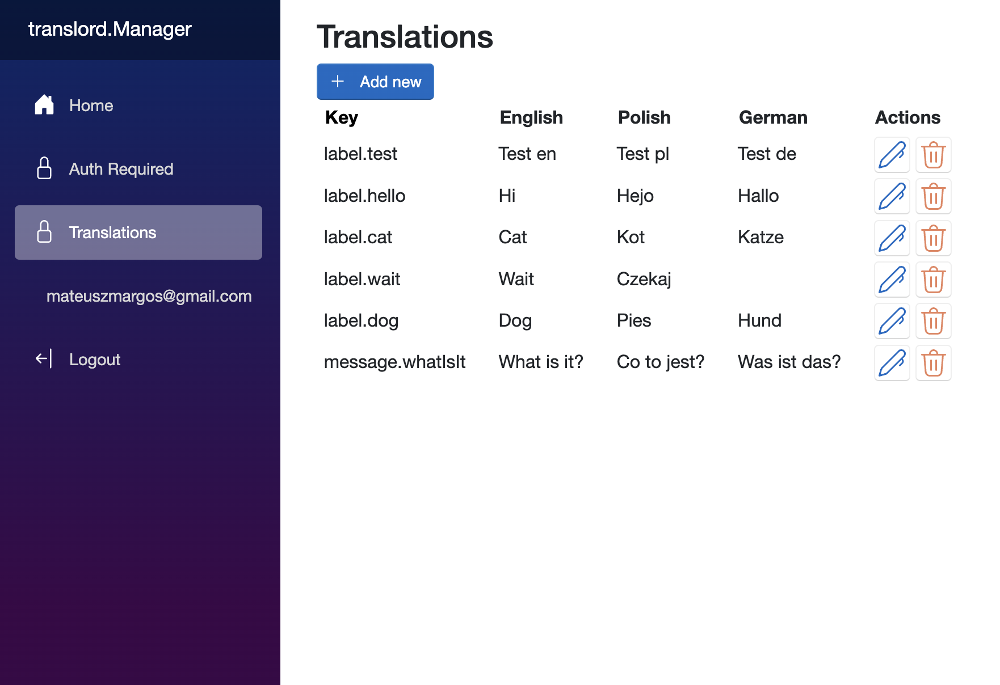

# translord

---

<div align="center">

  

</div>

---

#### translord - simple TMS to get your translations up and running in no time.

🚧 Project under development 

What this tool aims to achieve? To be a central place in your project that handles all things related to your translations:
- storing
- translating
- delivering
- management
- revision

## Configuration examples

### WebApp with FileStore
```c#
builder.Services.AddTranslordFileStore(options =>
{
    options.TranslationsPath = Path.Combine(Directory.GetCurrentDirectory(), "translations");
});
builder.Services.AddTranslord(o =>
{
    List<Language> supportedLanguages = [Language.English, Language.Polish, Language.German];
    o.SupportedLanguages = supportedLanguages;
    o.IsCachingEnabled = true;
});
```

### WebApp with PostgresStore and TMS panel
```c#
builder.Services.AddTranslordPostgresStore(options =>
    options.ConnectionString = builder.Configuration.GetConnectionString("DefaultConnection") ?? string.Empty);
builder.Services.AddTranslord(o =>
{
    List<Language> supportedLanguages = [Language.English, Language.Polish, Language.German];
    o.SupportedLanguages = supportedLanguages;
    o.IsCachingEnabled = true;
});
builder.AddTranslordManager();
```

### Console app with FileStore
```c#
List<Language> supportedLanguages = [ Language.English, Language.Polish ];
var path = Path.Combine(Directory.GetCurrentDirectory(), "translations");
var translator =
    new TranslatorConfiguration(
        new TranslatorConfigurationOptions { SupportedLanguages = supportedLanguages, IsCachingEnabled = true },
        new FileStore(new FileStoreOptions { TranslationsPath = path })).CreateTranslator();

var label = await translator.GetTranslation("label.test", Language.Polish);
var translations = await translator.GetAllTranslations(Language.English);
```

## TMS panel



## Features

### Must have

- [x] modularity
- [x] easy configuration
- [x] storing (EF Core/Postgres/File)
- [x] DeepL translations
- [x] CMS-like panel
- [ ] import of existing translations
- [ ] examples (in progress)

### Nice to have

- [ ] AI based translations
- [ ] caching (in progress)
- [ ] role-based access to the CMS panel
- [ ] translations revision

## Inspiration

- IdentityServer (as for config and ease of use)
- Serilog (as for modularity, structure)

## Support

Feel free to add issues with suggestions.