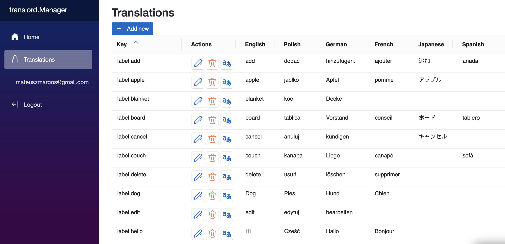

# translord

---
### Nuget

[](https://www.nuget.org/packages/translord)
[](https://www.nuget.org/packages/translord.DeepL)
[](https://www.nuget.org/packages/translord.EntityFramework)
[](https://www.nuget.org/packages/translord.EntityFramework.Postgres)
[](https://www.nuget.org/packages/translord.Manager)
[](https://www.nuget.org/packages/translord.RedisCache)

---

<div align="center">

  

</div>

---

#### translord - simple TMS to get your translations up and running in no time.

🚧 Project still in the early stages of development 

What this tool aims to achieve? To be a central place in your project that handles all things related to your translations:
- storing
- translating
- delivering
- management
- revision

## Packages
- translord
    - The core library
- [translord.DeepL](https://github.com/margosmat/translord/tree/main/translord.DeepL)
    - Library containing [DeepL API](https://www.deepl.com/pro-api?cta=header-pro-api) configuration for texts translation in translord.
- [translord.EntityFramework](https://github.com/margosmat/translord/tree/main/translord.EntityFramework)
    - Library containing configuration data that uses EntityFramework as its database abstraction.
- [translord.EntityFramework.Postgres](https://github.com/margosmat/translord/tree/main/translord.EntityFramework.Postgres)
    - Library extending the `translord.EntityFramework` library with Postgres configuration.
- [translord.Manager](https://github.com/margosmat/translord/tree/main/translord.Manager)
    - Library containing the TMS admin panel allowing for translations editing/management/translation.
- [translord.RedisCache](https://github.com/margosmat/translord/tree/main/translord.RedisCache)
    - Library containing configuration for Redis as the cache for translord.

## Configuration examples

### WebApp with FileStore
```c#
builder.Services.AddTranslordFileStore(options =>
{
    options.TranslationsPath = Path.Combine(Directory.GetCurrentDirectory(), "translations");
});
builder.Services.AddTranslord(o =>
{
    List<Language> supportedLanguages = [Language.English, Language.Polish, Language.German];
    o.SupportedLanguages = supportedLanguages;
});
```

### WebApp with PostgresStore and TMS panel
```c#
builder.Services.AddTranslordPostgresStore(options =>
    options.ConnectionString = builder.Configuration.GetConnectionString("DefaultConnection") ?? string.Empty);
builder.Services.AddTranslord(o =>
{
    List<Language> supportedLanguages = [Language.English, Language.Polish, Language.German];
    o.SupportedLanguages = supportedLanguages;
});
builder.AddTranslordManager();
```

### Console app with FileStore
```c#
List<Language> supportedLanguages = [ Language.English, Language.Polish ];
var path = Path.Combine(Directory.GetCurrentDirectory(), "translations");
var deeplTranslator = new DeepLTranslator(new AddTranslordDeepLTranslatorOptions { AuthKey = "your-auth-key" });
var translator =
    new TranslatorConfiguration(
        new TranslatorConfigurationOptions { SupportedLanguages = supportedLanguages, DefaultLanguage = Language.English },
        new FileStore(new FileStoreOptions { TranslationsPath = path }, null),
        deeplTranslator).CreateTranslator();

var label = await translator.GetTranslation("label.test", Language.Polish);
var translations = await translator.GetAllTranslations(Language.English);
```

### FileStore
Core `translord` package contains the `FileStore` implementation. The only requirement is the `TranslationsPath` for the `FileStore` to load the translations from. Be sure that the directory exists, otherwise `FileStore` will throw an error.

### Custom implementations
You can configure your own custom implementations for the **store**, **cache** or **translator** in translord. Just implement specific interface and be sure to register it in DI:
```c#
builder.Services.AddTranslordCustomStore<CustomTranslationsStore>();
builder.Services.AddTranslordCustomCache<CustomTranslationsCache>();
builder.Services.AddTranslordCustomTranslator<CustomTranslationsTranslator>();
```

## Import
For now, you can import your translations in one specific way. You need one `.json` file per language, with root object containing string key-value pairs of your translations. In the future there could be more import schemas added, please add an issue if you need support for specific import schema. Example of json that can be imported now:
```json
{
    "label.add": "add",
    "label.delete": "delete",
    ...
}
```

## TMS panel



## Demo


https://github.com/margosmat/translord/assets/25266191/198265df-2397-4b0d-ab4d-5172cdf6bd75


## Examples
Please check [examples](https://github.com/margosmat/translord/tree/main/examples) folder for example projects using translord to manage translations.


## Features

- [x] modularity
- [x] easy configuration
- [x] storing (EF Core/Postgres/File)
- [x] DeepL translations
- [x] CMS-like panel
- [x] import of existing translations
- [x] caching (using Redis)
- [x] examples

### Ideas for the next features

- [ ] AI based translations
- [ ] role-based access to the CMS panel
- [ ] translations revision

## Inspiration

- IdentityServer (as for config and ease of use)
- Serilog (as for modularity, structure)

## Support

Feel free to add issues with suggestions.
